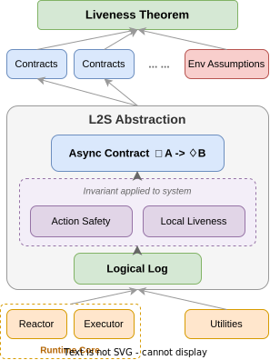

# Lion

<p align="center">
  
</p>

Lion is an asynchronous runtime whose liveness is formally verified through a
novel **Logical-Log-based Specification (L2S)** abstraction. A defining
strength of the L2S methodology is its generality: it rests only on the basic
verification primitives — Hoare logic, ghost variables, and quantifiers — so it
can be discharged in any deductive verifier without requiring extra extensions
(such as native temporal-logic operators), and it imposes no constraints on the
concrete design of the system it is applied to. The latter freedom pays off in
practice: in our experiments, the verified runtime achieves performance
comparable to its unverified counterpart (Tokio), matching its throughput
within ±5%.

The most interesting parts of the codebase are `lion-executor` and
`lion-reactor`, the runtime's core. Each demonstrates how a component's
executable code is mapped onto L2S state, and defines and verifies a family of
invariants over it. Those invariants are in turn used to discharge more
abstract **Async Contracts** — collected in the corresponding subfolders under
`lion-liveness` — such as *"once a timer is registered, then under the stated
assumptions it is guaranteed to eventually be woken."* Finally, `lion-liveness`
ties everything together: a glue proof chains these downstream contracts into
the top-level conclusion — *"once a task is spawned, then under the stated
assumptions it is guaranteed to be driven to completion."*

A detailed treatment of L2S will appear in the Lion paper (SOSP '26); an
extended technical report is available in
[`lion-liveness/doc/`](lion-liveness/doc/) (prebuilt `main.pdf`; rebuild with
`build.sh`).

## Running the experiments

Each experiment under `lion-benchmark/` has its own `README.md` and a `run.sh`
(with a methodology header); start there for full instructions. In brief:

```bash
cd lion-benchmark
./setup.sh                     # one-time deps (cmake, wrk, plotting venv, ...)
SETUP_IRONFLEET=1 ./setup.sh   # additionally for ironfleet (Dafny 3.4 + .NET 6 + scons)

./micro/run.sh                 # micro benchmarks (local)
./real-world/pingora/run.sh    # local (canonical); rumqtt / axum need hosts.env (cross-machine)
./correctness-stress/run.sh    # liveness stress vs Tokio (+ libevent-tests/ libuv-tests/ for the C ports)
./ironfleet/run.sh             # IronRSL Paxos with Lion async I/O

# or regenerate the collected dataset in one command, in the paper's exact
# topology (server apps here + load generator on CLIENT_HOST; axum additionally
# measured in its localhost deployment). Copy real-world/hosts.env.example to
# real-world/hosts.env first; ~4 h total on the paper machines:
STAGES="realworld micro ironfleet" ./collect_paper_data.sh
```

micro, ironfleet, correctness-stress, and the pingora benchmark default to
a local run; the rumqtt and axum benchmarks reproduce the paper's
cross-machine topology and require `hosts.env`. Duration, reps, and other
knobs are environment variables documented in each experiment's
README/run.sh. Compare your output against the shipped reference dataset:
each experiment has a `ref-result/` collected from a fresh clone of this
repository on the post-audit code (earlier collection batches agreed
per-cell with it and are recorded in the audit reports). Commit identifiers
recorded in `PROVENANCE.txt` files and in the audit reports are
development-history identifiers that predate this repository's initial
commit; they name the exact development state each batch was collected
from.

### Artifact evaluation: compare conclusions, not absolute numbers

The performance numbers in the pre-camera-ready version of the paper were
collected on different machines than the shipped reference dataset, so the
paper's absolute values and `ref-result/` disagree — and your machine will
produce yet another set of absolute values. This is expected. What the
artifact supports, and what we ask evaluators to check, are the **relative
conclusions**, which reproduce across every machine and batch we have run:

- **Micro benchmarks** (`micro/`): Lion's single-thread throughput is in the
  same range as Tokio's on every primitive — ahead on some cells, behind on
  others, with no consistent loser. In multi-thread scaling, Lion and
  Tokio-Partition scale with thread count while stock Tokio's work-stealing
  runtime *degrades* as threads are added (the headline scheduling result).
- **Real-world applications** (`real-world/`): Lion is a drop-in replacement
  for Tokio at parity performance — throughput stays close to Tokio's on
  every workload, and on the runtime-bound cells (axum localhost) Lion is
  the faster runtime. Cells pinned by an external ceiling (the
  link-saturated axum cross-machine rows; the pingora 10 KB payload's
  intrinsic body-handling ceiling) show exact parity by construction.
- **Correctness under stress** (`correctness-stress/`): every tested
  bug-carrying release of Tokio, libevent, and libuv hangs deterministically
  on its known liveness bug under the stress workload; Lion passes every
  configuration, every time.
- **IronFleet integration** (`ironfleet/`): replacing the verified Paxos
  node's threaded C# I/O with Lion yields substantially higher throughput
  (unpinned, and by a wide margin when pinned to a single core) at a
  fraction of the CPU — Lion outperforms the threaded C# I/O layer in
  every regime.

If a relative conclusion above does not hold on your hardware, that is a
finding we want to hear about; absolute-value differences from the paper or
from `ref-result/` are not.

## Verifying the proofs

First install the toolchain the proofs need with the top-level `./setup.sh` — it
sets up the pinned Rust toolchain and Verus (into `verus-toolchain/`). Then:

```bash
./setup.sh    # one-time: Rust toolchain + Verus
./ci.sh       # verify every crate
```

`./ci.sh` runs each verified crate's `verify.sh` — the four shared spec crates
(`lion-framework-spec`, `lion-executor-spec`, `lion-reactor-spec`,
`lion-utility-spec`), the leaf data structures (`lion-slab`, `lion-timer-wheel`),
the runtime core (`lion-reactor`, `lion-executor`), `lion-utility`, and finally
the composing `lion-liveness`. A full run takes a few minutes on a modern
multi-core machine (the SMT-heavy `lion-liveness` crate itself verifies in well
under a minute).

Note: `./verify.sh` (cargo-verus) is the authoritative gate. A plain
`cargo build` of `lion-liveness` currently fails with an unresolved import on
ghost-only spec-fn re-exports — a known limitation of building proof code
without the Verus driver; it does not affect verification or the runtime crates.

## Trusted computing base & limitations

Every claim above is machine-checked *modulo* an explicitly trusted base, inventoried
per-item in [`TCB_and_limitations.md`](TCB_and_limitations.md):

- **`external_body` boundary functions** (126 across the six verified crates — OS/syscall
  wrappers, waker vtables, low-level slot operations) whose postconditions are trusted,
  not verified — plus one fully-unchecked `#[verifier::external]` item;
- **the Verus toolchain and its SMT solver** (Verus pinned by `setup.sh`, bundling Z3 4.12.5; see `verus.config`);
- **model↔implementation correspondence**: the event vocabulary and invariant definitions
  are shared crates (`lion-framework-spec`, `lion-executor-spec`, `lion-reactor-spec`,
  `lion-utility-spec`) consumed by both the liveness proof and the impl-verified crates,
  so both sides quantify over the same definitions; the io API/syscall registration-anchor
  duality is explicit (`io_api_*` vs `io_syscall_*`) and closed by a proven bridge
  (`lion-reactor-spec::bridge`). The remaining *informal* residue is the ghost-log protocol
  at the `external_body` boundary (each "action" invoked exactly once, in order, around its
  real effect) and the utilities layer's crate-local invariants — there is still no
  mechanized refinement proof from the compiled runtime to the model.

The top-level theorem is a *bounded, filtered* liveness statement — "every `n`-step run
along which the environment assumptions hold at every state ends with the task completed"
(a □env ⇒ ◇goal form) — with its assumptions' joint satisfiability and the theorem
domain's non-vacuity machine-checked by concrete witness executions on all four wake
paths. Known modeling limitations are listed in `TCB_and_limitations.md`.

An async program can hang for reasons on any layer — application logic, violated calling
conventions, the runtime itself, or OS primitives breaking their implicit contracts. Lion
removes the runtime *core* from that suspect pool, but the coverage has a boundary: during
development we hit (and fixed) several liveness incidents ourselves, and every one of them
sat *outside* the verified region, in the trusted glue above. That is both evidence the
proofs are guarding the right code and a map of the residual risk. Two representative
cases — a real lost-wakeup hang in connect glue, and a "hang" that verification helped
reclassify as a 125,000× slowdown in five minutes — are written up in
[`HANG_FIXING_STORY.md`](HANG_FIXING_STORY.md).

## License

Licensed under the [MIT license](LICENSE). Unless you explicitly state otherwise,
any contribution intentionally submitted for inclusion in this work by you shall
be licensed as above, without any additional terms or conditions.

