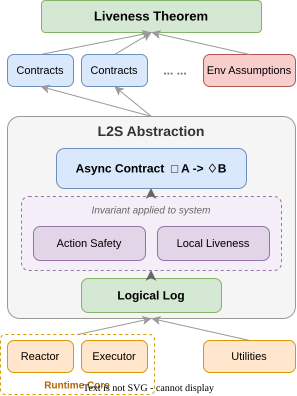

# Lion

<a href="https://doi.org/10.5281/zenodo.22061599"></a>
<a href="https://sysartifacts.github.io/sosp2026/badges"></a>
<a href="https://sysartifacts.github.io/sosp2026/badges"></a>
&nbsp;
<a href="https://sigops.org/s/conferences/sosp/2026/"></a>
<a href="https://doi.org/10.5281/zenodo.22061599"></a>

<p align="center">
  
</p>

Lion is an asynchronous runtime whose liveness is formally verified through a
novel **Logical-Log-based Specification (L2S)** abstraction. A defining
strength of the L2S methodology is its generality: it rests only on the basic
verification primitives — Hoare logic, ghost variables, and quantifiers — so it
can be discharged in any deductive verifier without requiring extra extensions
(such as native temporal-logic operators), and it imposes no constraints on the
concrete design of the system it is applied to. The latter freedom pays off in
practice: in our experiments, the verified runtime achieves performance
comparable to its unverified counterpart (Tokio) — we measure at least 95% of
unverified-runtime throughput on nine real-world workloads.

The most interesting parts of the codebase are `lion-executor` and
`lion-reactor`, the runtime's core. Each demonstrates how a component's
executable code is mapped onto L2S state, and defines and verifies a family of
invariants over it. Those invariants are in turn used to discharge more
abstract **Async Contracts** — collected in the corresponding subfolders under
`lion-liveness` — such as *"once a timer is registered, then under the stated
assumptions it is guaranteed to eventually be woken."* Finally, `lion-liveness`
ties everything together: a glue proof chains these downstream contracts into
the top-level conclusion — *"once a task is spawned, then under the stated
assumptions it is guaranteed to be driven to completion."*

A detailed treatment of L2S will appear in the Lion paper (SOSP '26); an
extended technical report is available in
[`lion-liveness/doc/`](lion-liveness/doc/) (prebuilt `main.pdf`; rebuild with
`build.sh`). Where the artifact and the submitted manuscript differ — the
evaluation numbers were re-collected on new machines for the camera-ready — the
paragraph "Known exceptions to the parity claim" below says what to expect.

A component-by-component map of the repository — what each crate is and
where it appears in the paper — is in
[`REPOSITORY_MAP.md`](REPOSITORY_MAP.md).

## Running the experiments

### Before you run

| | |
|---|---|
| Time | ~4 h for the full `collect_paper_data.sh`, of which ~3.5 h is measurement time fixed by the protocol (30 s × 10 runs per cell) — a faster machine shortens the builds, not the measurement |
| Disk | ~10 GB: a fresh clone is 93 MB, the toolchains `setup.sh` installs ~5 GB, build artifacts ~4.8 GB |
| Memory | **≥ 16 GB.** Every step but one peaks below 2 GB; the micro benchmark's timer cells reach ~10 GB in a single process |
| Cores | no minimum; the cross-machine rows need a second host, and the paper's link is 1 GbE |

- [`REQUIREMENTS.md`](REQUIREMENTS.md) — the machine the reference dataset was
  collected on, the full dependency list, and the per-stage time, disk and
  memory budget.
- [`EXPECTED_OUTPUT.md`](EXPECTED_OUTPUT.md) — what each step prints when it is
  working, which alarming-looking messages are expected (**nine of the thirty
  correctness-stress cells are supposed to hang**), and which ones mean the
  result is invalid.

To undo everything afterwards, `./uninstall.sh` (dry run by default, `--yes` to
apply) removes exactly what `setup.sh` installed — it replays the manifest
`setup.sh` writes, so anything the machine already had is left alone — plus the
build artifacts and experiment output.

### Reproducing the paper's results, start to finish

1. **Install the proof toolchain** — `./setup.sh` in the repository root (Rust
   1.91.0 + Verus into `verus-toolchain/`).
2. **Check the proofs** — `./ci.sh`. This is the claim in the paper's
   verification sections; it ends in `All checks passed`. How long it takes is
   set by how much still has to be compiled and verified: seconds on a tree that
   has not changed since the last run, and several minutes the first time.
3. **Install the experiment toolchain** — `SETUP_IRONFLEET=1
   lion-benchmark/setup.sh`. Drop `SETUP_IRONFLEET=1` to skip the IronFleet
   experiment (it pulls Dafny and .NET).
4. **Decide on the topology.** The micro, correctness-stress and pingora
   experiments are single-machine and need nothing further. The rumqtt, axum and
   IronFleet rows are cross-machine: copy `real-world/hosts.env.example` to
   `real-world/hosts.env`, fill in the two hosts, and run
   `lion-benchmark/setup.sh` **on the client host as well**
   (`SETUP_IRONFLEET=1` there too). Without `hosts.env` those three run fully
   local, which is a smoke test rather than the paper's measurement — each
   `run.sh` prints the topology it actually used.
5. **Collect** — `STAGES="realworld micro stress ironfleet"
   lion-benchmark/collect_paper_data.sh` runs everything in the paper's protocol
   (~4 h), or run individual `run.sh` scripts as below.
6. **Compare** — against each experiment's `ref-result/` and `ref-2/`, using the
   relative conclusions listed under "compare conclusions, not absolute numbers"
   below, not the absolute values.
7. **Clean up** — `./uninstall.sh --yes`.

Each experiment under `lion-benchmark/` has its own `README.md` and a `run.sh`
(with a methodology header); start there for full instructions. In brief:

```bash
cd lion-benchmark
./setup.sh                     # one-time deps (cmake, wrk, plotting venv, ...)
SETUP_IRONFLEET=1 ./setup.sh   # additionally for ironfleet (Dafny 3.4 + .NET 6 + scons)
# For a cross-machine run, setup.sh must also be run ON THE CLIENT HOST: it needs
# wrk locally, and the IronRSL client is a .NET app (so SETUP_IRONFLEET=1 there
# too). Nothing else has to be installed or checked out there — the benchmarks
# ship the scripts and binaries the client needs and assume no shared filesystem.

./micro/run.sh                 # micro benchmarks (local)
./real-world/pingora/run.sh    # local (canonical); rumqtt / axum need hosts.env (cross-machine)
./correctness-stress/run.sh    # liveness stress vs Tokio (+ libevent-tests/ libuv-tests/ for the C ports)
./ironfleet/run.sh             # IronRSL Paxos with Lion async I/O

# or regenerate the collected dataset in one command, in the paper's exact
# topology (server apps here + load generator on CLIENT_HOST; axum additionally
# measured in its localhost deployment). Copy real-world/hosts.env.example to
# real-world/hosts.env first; ~4 h total on the paper machines:
STAGES="realworld micro ironfleet" ./collect_paper_data.sh
```

micro, correctness-stress, and the pingora benchmark are single-machine; the
rumqtt, axum, and ironfleet benchmarks reproduce the paper's cross-machine
topology and read `real-world/hosts.env` (without it they run fully local,
which is a smoke test rather than the paper's measurement — each run.sh
prints the topology it is actually using). Duration, reps, and other
knobs are environment variables documented in each experiment's
README/run.sh. Compare your output against the shipped reference dataset:
each experiment has a `ref-result/` collected from a fresh clone of this
repository on the post-audit code (earlier collection batches agreed
per-cell with it and are recorded in the audit reports). Commit identifiers
recorded in `PROVENANCE.txt` files and in the audit reports are
development-history identifiers that predate this repository's initial
commit; they name the exact development state each batch was collected
from.

**Known exceptions to the parity claim.** We collected the shipped results
on two machine configurations of our own; during artifact evaluation, three
reviewers additionally ran the benchmarks on their own hardware, and two of
them separately reported cells that fall visibly below parity. One
reviewer measured Lion at 82% of Tokio's throughput on a loopback
deployment of the rumqtt workload (a deployment the planned experiment
matrix does not cover — rumqtt runs cross-machine only). Another measured
72.3% of Tokio's on the micro-benchmark TCP suite at 500 connections — an
outlier for that cell, which measures around 90% of Tokio's on every other
configuration, ours and the other reviewers' alike. We read these as evidence
that Tokio's deep optimization can still pull ahead in configurations and
scenarios our coverage has missed: Lion demonstrates that deep optimization
and formally verified correctness are compatible, but in its current state
it does not yet match Tokio everywhere.

## Verifying the proofs

First install the toolchain the proofs need with the top-level `./setup.sh` — it
sets up the pinned Rust toolchain and Verus (into `verus-toolchain/`). Then:

```bash
./setup.sh    # one-time: Rust toolchain + Verus
./ci.sh       # verify every crate
```

`./ci.sh` runs each verified crate's `verify.sh` — the four shared spec crates
(`lion-framework-spec`, `lion-executor-spec`, `lion-reactor-spec`,
`lion-utility-spec`), the leaf data structures (`lion-slab`, `lion-timer-wheel`),
the runtime core (`lion-reactor`, `lion-executor`), `lion-utility`, and finally
the composing `lion-liveness`. A full run takes a few minutes on a modern
multi-core machine (the SMT-heavy `lion-liveness` crate itself verifies in well
under a minute).

Note: `./verify.sh` (cargo-verus) is the authoritative gate. A plain
`cargo build` of `lion-liveness` currently fails with an unresolved import on
ghost-only spec-fn re-exports — a known limitation of building proof code
without the Verus driver; it does not affect verification or the runtime crates.

## Trusted computing base & limitations

Every claim above is machine-checked *modulo* an explicitly trusted base, inventoried
per-item in [`TCB_and_limitations.md`](TCB_and_limitations.md):

- **`external_body` boundary functions** (126 across the six verified crates — OS/syscall
  wrappers, waker vtables, low-level slot operations) whose postconditions are trusted,
  not verified — plus one fully-unchecked `#[verifier::external]` item;
- **the Verus toolchain and its SMT solver** (Verus pinned by `setup.sh`, bundling Z3 4.12.5; see `verus.config`);
- **model↔implementation correspondence**: the event vocabulary and invariant definitions
  are shared crates (`lion-framework-spec`, `lion-executor-spec`, `lion-reactor-spec`,
  `lion-utility-spec`) consumed by both the liveness proof and the impl-verified crates,
  so both sides quantify over the same definitions; the io API/syscall registration-anchor
  duality is explicit (`io_api_*` vs `io_syscall_*`) and closed by a proven bridge
  (`lion-reactor-spec::bridge`). The remaining *informal* residue is the ghost-log protocol
  at the `external_body` boundary (each "action" invoked exactly once, in order, around its
  real effect) and the utilities layer's crate-local invariants — there is still no
  mechanized refinement proof from the compiled runtime to the model.

The top-level theorem is a *bounded, filtered* liveness statement — "every `n`-step run
along which the environment assumptions hold at every state ends with the task completed"
(a □env ⇒ ◇goal form) — with its assumptions' joint satisfiability and the theorem
domain's non-vacuity machine-checked by concrete witness executions on all four wake
paths. Known modeling limitations are listed in `TCB_and_limitations.md`.

An async program can hang for reasons on any layer — application logic, violated calling
conventions, the runtime itself, or OS primitives breaking their implicit contracts. Lion
removes the runtime *core* from that suspect pool, but the coverage has a boundary: during
development we hit (and fixed) several liveness incidents ourselves, and every one of them
sat *outside* the verified region, in the trusted glue above. That is both evidence the
proofs are guarding the right code and a map of the residual risk. Two representative
cases — a real lost-wakeup hang in connect glue, and a "hang" that verification helped
reclassify as a 125,000× slowdown in five minutes — are written up in
[`HANG_FIXING_STORY.md`](HANG_FIXING_STORY.md).

## License

Licensed under the [MIT license](LICENSE). Unless you explicitly state otherwise,
any contribution intentionally submitted for inclusion in this work by you shall
be licensed as above, without any additional terms or conditions.

